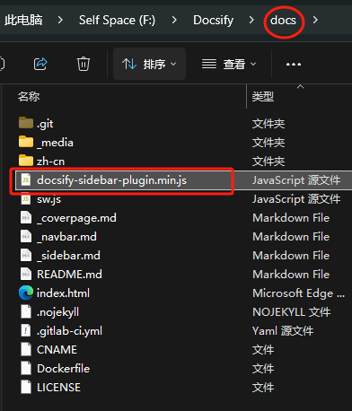
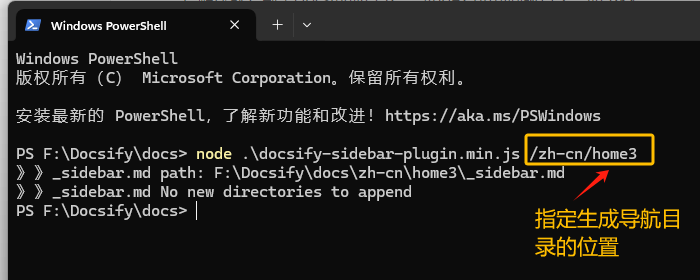

# 一行命令快速创建_sidebar.md多级目录

​	Docsify sidebar插件：[👍自动生成docsify多级目录_sidebar.md和README.md的工具：docsify-sidebar-plugin](https://github.com/aishangxuejie/docsify-sidebar-plugin)

​	这是一款超级便捷、超级实用、简单且优雅的生成_sidebar.md的方案。作者可以专注于内容创作、一键生成内容目录。

## 优势

1. 开源MIT。
2. 灵活、轻便、简单、美观。
3. 不仅可以一次性生成多级目录，还可以追加更新目录。
4. 为导航添加了有趣的emoji图标。

## 效果

### 1、Typora中查看生成目录效果


### 2、浏览器查看效果


# 下载

1. GitHub:[Releases · aishangxuejie/docsify-sidebar-plugin](https://github.com/aishangxuejie/docsify-sidebar-plugin/releases)

# 执行

> 确保你已经安装了 Node.js

## 1、解压或复制

​	移动docsify-sidebar-plugin.min.js至Docsify项目下，与index.html同级目录。如下图，



2、执行命令

```shell
# 运行以下命令来执行脚本，并传递一个相对路径参数：
npm run gen <relative-path>

or

node docsify-sidebar-plugin.nimi.js <relative-path>

# 例如，如果你想要生成 _sidebar.md 文件的目录是 docs，你可以运行：
# npm run gen docs  or  node docsify-sidebar-plugin.js docs
# 控制台会输出生成路径
```



