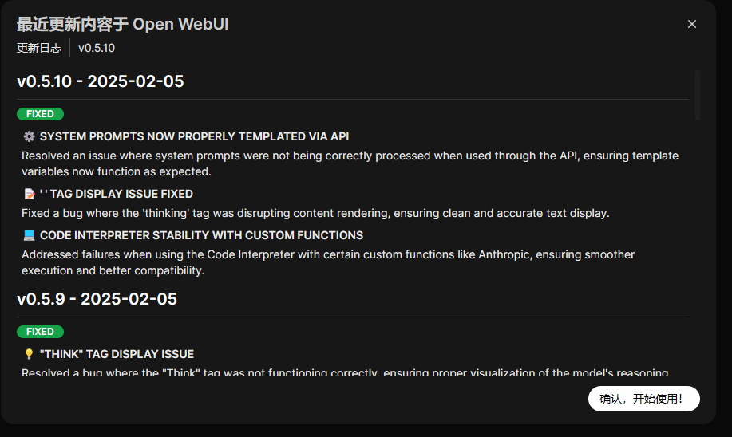

官方网址：[Ollama](https://ollama.com/)


Get up and running with large language models.

**Ollama**是一个开源的 LLM（大型语言模型）服务工具。

# Ollama 安装和常用系统参数设置

**Ollama**的安装过程，与安装其他普通软件并没有什么两样，安装完成之后，有几个常用的系统**环境变量**参数建议进行设置：

1. **OLLAMA_MODELS**：模型文件存放目录，默认目录为当前用户目录（Windows 目录：`C:\Users%username%.ollama\models`，MacOS 目录：`~/.ollama/models`，Linux 目录：`/usr/share/ollama/.ollama/models`），如果是 Windows 系统**建议修改**（如：D:），避免 C 盘空间吃紧
2. **OLLAMA_HOST**：Ollama 服务监听的网络地址，默认为**127.0.0.1**，如果允许其他电脑访问 Ollama（如：局域网中的其他电脑），**建议设置**成**0.0.0.0**，从而允许其他网络访问
3. **OLLAMA_PORT**：Ollama 服务监听的默认端口，默认为**11434**，如果端口有冲突，可以修改设置成其他端口（如：**8080**等）
4. **OLLAMA_ORIGINS**：HTTP 客户端请求来源，半角逗号分隔列表，若本地使用无严格要求，可以设置成星号，代表不受限制
5. **OLLAMA_KEEP_ALIVE**：大模型加载到内存中后的存活时间，默认为**5m**即 5 分钟（如：纯数字如 300 代表 300 秒，0 代表处理请求响应后立即卸载模型，任何负数则表示一直存活）；我们可设置成**24h**，即模型在内存中保持 24 小时，提高访问速度
6. **OLLAMA_NUM_PARALLEL**：请求处理并发数量，默认为**1**，即单并发串行处理请求，可根据实际情况进行调整
7. **OLLAMA_MAX_QUEUE**：请求队列长度，默认值为**512**，可以根据情况设置，超过队列长度请求被抛弃
8. **OLLAMA_DEBUG**：输出 Debug 日志标识，应用研发阶段可以设置成**1**，即输出详细日志信息，便于排查问题
9. **OLLAMA_MAX_LOADED_MODELS**：最多同时加载到内存中模型的数量，默认为**1**，即只能有 1 个模型在内存中

## 目录参考

模型默认存储地址为:

macOS: ~/.ollama/models

Linux: /usr/share/ollama/.ollama/models 

> 作为系统服务启动时 Linux: /home/.ollama/models 
>
> 当前用户启动时 Windows: C:<username>.ollama

**Windows用户**

1. 设置 OLLAMA_MODELS

```
# 只设置当前用户
setx OLLAMA_MODELS "D:\ollama_model" 
# 为所有用户设置
setx OLLAMA_MODELS "D:\ollama_model" /M
```

1. 重启终端（setx命令在Windows中设置环境变量时，这个变量的更改只会在新打开的命令提示符窗口或终端会话中生效。）
2. 重启ollama服务

**Linux一般用户**

```
# 打开下面文件
nano ~/.bashrc
# 添加设置
export OLLAMA_MODELS="/path/to/ollama_model"

TEXT

ROUTEROS
```

1. 重启终端
2. 重启ollama服务： ollama serve


## Ollama 管理本地已有大模型

【展示本地大模型列表：`ollama list`】

【删除单个本地大模型：`ollama rm 本地模型名称`】

【设置模型下载目录：`ollama run 本地模型名`】

【查看本地运行中模型列表：`ollama ps`】


# Open WebUI

[Open WebUI](https://github.com/open-webui/open-webui)，以前称为 Ollama WebUI，是一个可扩展、功能丰富且用户友好的自托管 Web 界面，旨在完全离线运行。它支持各种大型语言模型 (LLM) 运行器，使其成为部署和与语言模型交互的多功能工具。

```
# If Ollama is on your computer, use this command:

docker run -d -p 3000:8080 --add-host=host.docker.internal:host-gateway -v open-webui:/app/backend/data --name open-webui --restart always ghcr.io/open-webui/open-webui:main

# If Ollama is on a Different Server, use this command:
# To connect to Ollama on another server, change the OLLAMA_BASE_URL to the server's URL:

docker run -d -p 3000:8080 -e OLLAMA_BASE_URL=https://example.com -v open-webui:/app/backend/data --name open-webui --restart always ghcr.io/open-webui/open-webui:main

# To run Open WebUI with Nvidia GPU support, use this command:

docker run -d -p 3000:8080 --gpus all --add-host=host.docker.internal:host-gateway -v open-webui:/app/backend/data --name open-webui --restart always ghcr.io/open-webui/open-webui:cuda
```

第一个在 Open WebUI 上注册的用户将被授予管理员权限。


