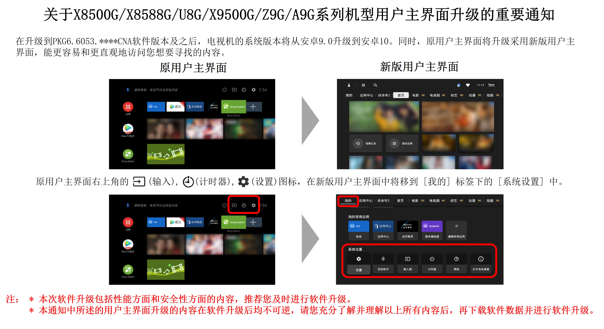
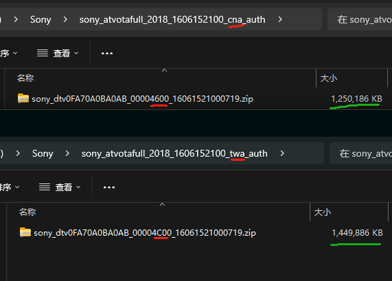

# 索尼电视主页变更为NewTV极光

原：[SONY China Service-BRAVIA平板电视机系统软件更新（针对2019年BRAVIA的X8500G/X8588G/BA35G/X9500G/U8G/Z9G/A9G系列的相关机型）](https://service.sony.com.cn/download/firm/00002739.html)

> PS：本人电视机型X8500G系列的

🙃难以接受的版本更新：主页强制变成了NewTV极光模式

> 【版本号】PKG6.6132.****CNA
>
> \- 改进电视机的综合性能
>
> \- 视频内容服务变更为NewTV极光（仅X8500G和X8588G系列机型）

## 尝试找回索尼原生主页

### 尝试一：启动 Pro 模式

官方教程：https://pro-bravia.sony.net/zhs/guides/references/prosettings/android_latest/1_actions/1-1_start_pro_mode/index.html

懒人教程：在主界面下，快速并且不间断地按顺序输入“返回”、“静音”、“音量+”和“主页”按键，电视屏幕就会进入Pro设置模式。

懒人教程：在主界面下，快速并且不间断地按顺序屏显、静音、音量＋、主菜单。屏幕顶部会显示Pro设置处理中。

### 尝试二：刷非大陆版升级包

0、了解电视信息

[如何查看索尼电视机的系统信息（如型号、软件版本、序列号和设备ID等）？ | Sony China](https://www.sony.com/zh-cn/electronics/support/articles/00115311)

1、下载最新升级包

登录官网下载对应型号固件。

- 台湾版：https://tv.update.sony.net/OND/2018/as/tw/PS214275/sony_atvotafull_2018_1606152100_twa_auth.zip

- 中国大陆特供：https://tv-update.sony.com.cn/OND/2018/as/ch/PS214272/sony_atvotafull_2018_1606152100_cna_auth.zip

2、解压分析文件，先尝试不做修改直接刷，如果不行再试着替换版本号再刷。

3、按照升级指导中的说明，将升级包解压缩，并将升级文件放置U盘的**根目录**中。（**注意：**升级文件名不可被修改，确保升级文件的大小正确。如名称或大小异常， 请清除电脑的浏览器缓存或更换浏览器后重新下载。）

4、然后再将USB设备连接至电视机的USB接口，电视机识别到升级文件后会自动执行更新。 

信心满满...

开整...

## 最终结果

😂经过我一番研究，最终得到了一个***==意想不到的==***解决方案。

...

...

...

### **更换新的主板（旧系统）**

...

...

### 过程日志

- 前几个月的某天 手贱点了更新无法退出，发现主页好丑

- 之后的几天，忍了

- 就这样过了好几个月，电视开机时间原来越少了

- 直到2024年12月24日 媳妇吐槽家里索尼电视的新系统卡，慢，乱

- 第二天，开始狂刷互联网，开始掘金，发现没啥卵用的信息

- 第三天，开始研究刷机，咨询索尼客服有没有回退的方式方法，老子是消费者，应该有选择权。结果就是上报等反馈。

- 2024年12月27日，收到骚扰电话拦截短信和索尼回馈短信，先加入白名单看看售后咋说吧。

  - 于是，经过我俩一番嘘寒问暖

  - 索尼技术中心先是表示，升级前有协议，肯定是需要用户同意的巴拉巴拉

  - 升级后系统确实是不可逆的

  - 然后可以免费更换新的主板，主板是原UI系统。

  - 然后我俩又是反复确认了售后啊，保修啊，上门更换啊等等流程等

- 开始漫长的等待

- 2025年2月5日，还没消息....

- 

### 收获

1. pro模式可以有很多操作空间
2. 
