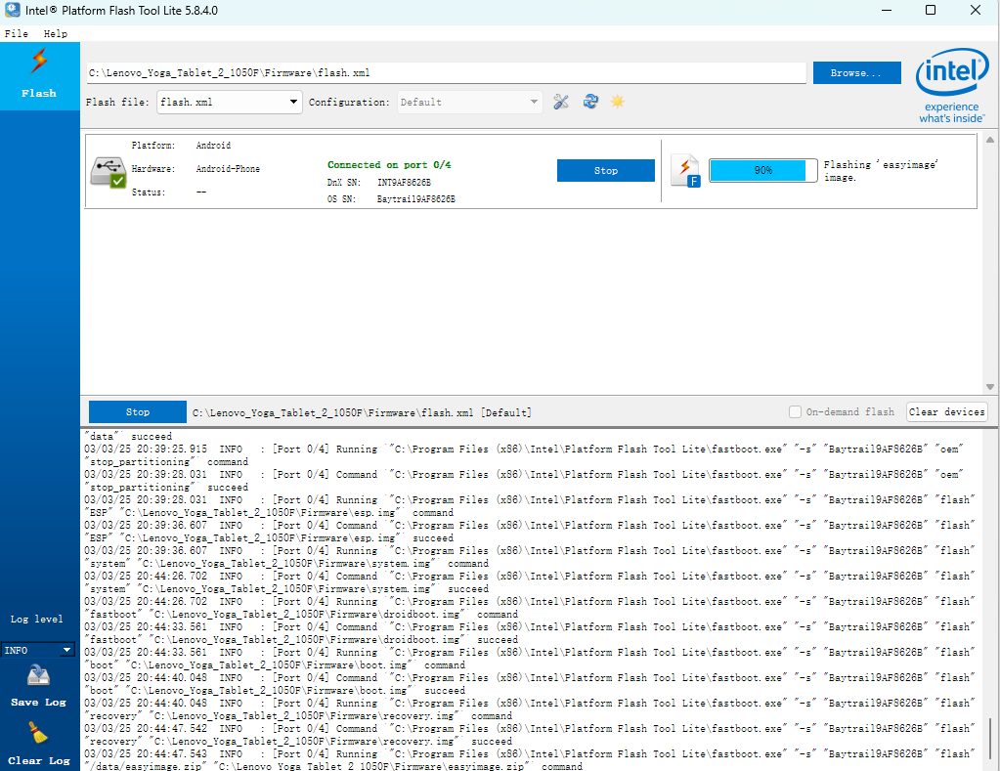
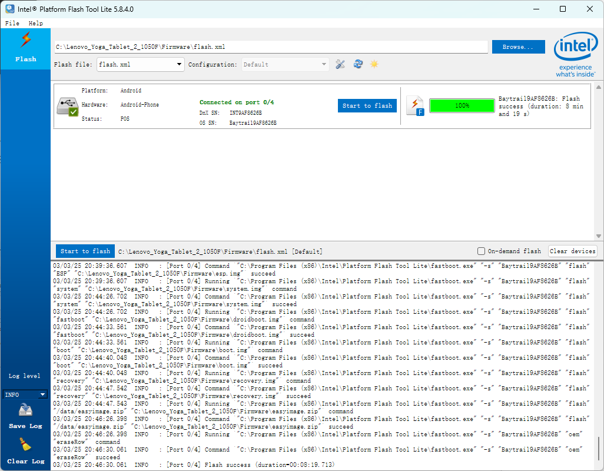

[Overview for YOGA Tablet 2-1050 - Lenovo Support US](https://support.lenovo.com/us/en/solutions/pd104158-overview-for-yoga-tablet-2-1050)

[yoga-tablet-1050f](http://2b.zol-img.com.cn/product/143_800x600/835/ceoojumoDblg.jpg)

《安卓Fastboot模式又称为快速启动模式》在安卓手机中Fastboot是一种比Recovery恢复模式更底层的刷机模式（俗称引导模式）。就是使用USB数据线连接手机的一种刷机模式。可以通过fastboot模式刷写系统或刷写修改手机系统里面的分区文件，现在大多数线刷包都是通过fastboot模式进行刷机的。

PS C:\Android> fastboot devices
INT9AF8626B     fastboot

主要是驱动难找

1. 卸载原驱动
2. 重新插拔USB
3. 设备管理器，查看新识别的usb设备，有感叹号证明驱动有问题。
4. 有感叹号就卸载驱动重复上述操作

折腾两次就能成了

fastboot reboot

基于Android x86研发定制的低端电脑系统版本。

比如说[Remix OS](https://zhida.zhihu.com/search?content_id=209043426&content_type=Article&match_order=1&q=Remix+OS&zhida_source=entity)、[PhoenixOS](https://zhida.zhihu.com/search?content_id=209043426&content_type=Article&match_order=1&q=PhoenixOS&zhida_source=entity)以及PrimeOS，都可以让你实现轻办公、玩一些安卓游戏等等。
