# 中兴F50玩机记录

## 思考日记

1.  第一次接触随身WiFi
2. 2025年1月15日，开车需要网，5G CPE太贵。中兴F50太便携了，拼夕夕290左右，带卡槽，就它了。
3. 2025年1月21日，开个性能模式，测个速。车载模式够用了，暂不考虑改散热，需要短信转发功能。
4. 2025年1月22日，研究研究硬件，用的国产5G 6nm SoC，展锐T760/T770。
5. 2025年1月22日，同款芯片手机包括中兴远航系列、畅行系列，努比亚小牛，朵唯等（紫光展锐T770天翼一号2022）。低端机市场。
6. 2025年1月24日，测速效果一般。有网友改装了WiFi发射天线，F50自身WiFi 5效果确实不咋地，可以考虑接上Wifi 6设备。
7. 2025年1月25日，明天开始年假，跑高速带着，4个小时导航音乐都稳定，有点大材小用的感觉。
8. 2025年2月5日，年假结束。开ADB模式，进入Android系统，是原生纯净版系统。玩法非常多，先安装短信短发器。
9. 2025年2月5日，
   1. 加个便携屏不就是5G Pad吗？
   2. 刷个电视盒子不就是5G 移动电视盒子吗？
   3. 还可刷个Android NAS？
   4. 二手的5G手机岂不是玩法更多，功能更全，价格更香？毕竟它出门还得挂个“尿袋”。
   5. 有空把F50的固件备份下来（中兴定制了一些系统的软件包），然后刷入天翼一号，改造手机。
10. 

## 购买建议

看到这篇文章的兄弟盟，

## 设备简介

### 采用**紫光展锐T760**的国产5G芯片方案，具备续航和性能更加均衡的5G移动平台。

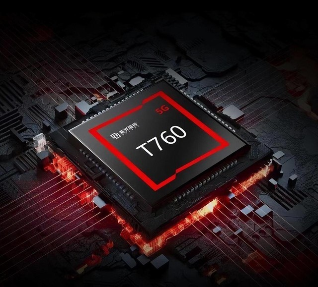


### 搭载Android 13系统


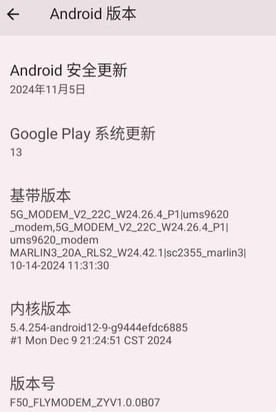

## 参考

[中兴F50 5G随身WiFi – 中兴手机官网](https://www.ztedevices.com/cn/product/zte-f50-5g-ufi/)

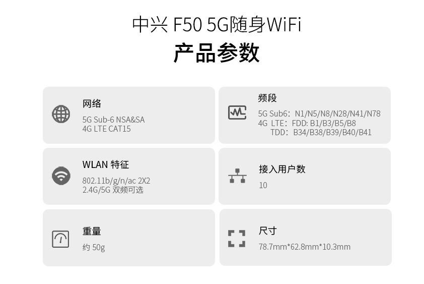

[中兴5G随身WiFi拆解：国产芯成为当之为愧的主角-机友交流专区-IoT行业资讯-机智云](https://club.gizwits.com/thread-170088-1-1.html)

<iframe
  src="https://club.gizwits.com/thread-170088-1-1.html"
  allowfullscreen="allowfullscreen"
  width="100%"
  height="800"
  scrolling="yes"
>
</iframe>

# 初阶玩法

锁频段，锁小区，开启性能模式。

## 1、开启性能模式

打开隐藏项: [5G Mobile Hotspot performance_mode](http://192.168.0.1/index.html#performance_mode)

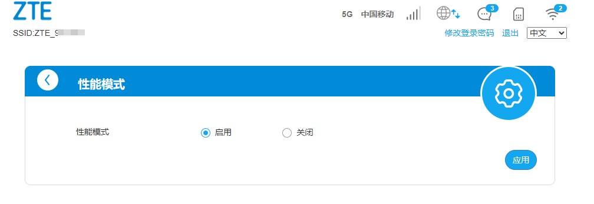

## 2、硬件升级

网购各种大神配套的扩展模块，扩展版来物理升级。如改造散热、加装天线、扩展接口....

# 进阶玩法

本质上还是个就是个搭载Android系统的减配手机（砍掉屏幕，摄像模块，音频模块等）。

**所以通过投屏和安装应用，就实现了上给电脑共享wifi的同时，又获得了一部5G手机。**

## 1、开启USB端口

打开隐藏项: [5G Mobile Hotspot usb_port](http://192.168.0.1/index.html#usb_port)

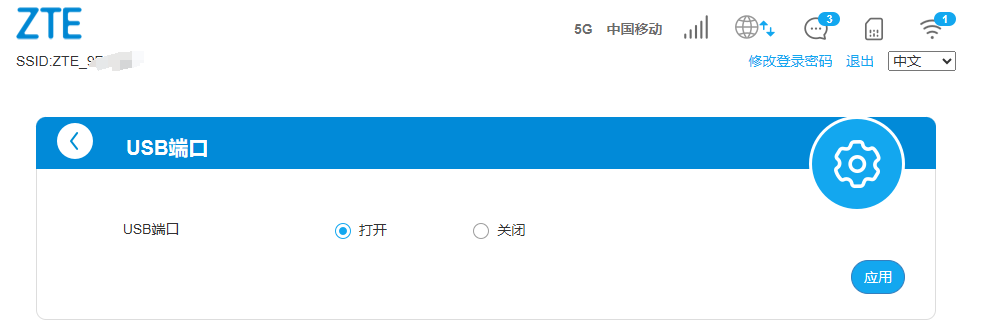

## 2、安装投屏scrcpy

- GitHub下载：scrcpy-win64-v3.1

- 安装好后，开始尝试投屏手机，列一下步骤

- 有线连接电脑跟手机，投屏方式：

```bat
# 1、打开手机的开发者模式
scrcpy-win64-v3.1> adb shell settings put global development_settings_enabled 1
# 2、确保手机与电脑usb连接，可以通过下面命令查看是否连接成功：
scrcpy-win64-v3.1> adb devices
adb server is out of date.  killing...
* daemon started successfully *
List of devices attached
32024686***   device
# 3、开始投屏
scrcpy-win64-v3.1> .\scrcpy.exe
# 4、结束投屏，中断命令即可
```

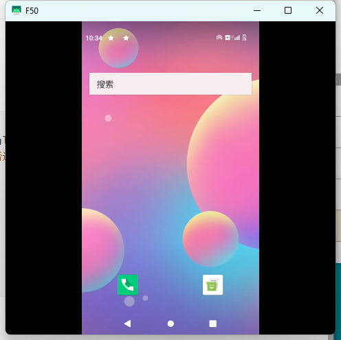

## 3、开始usb调试和无线调试

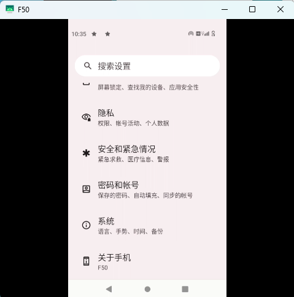

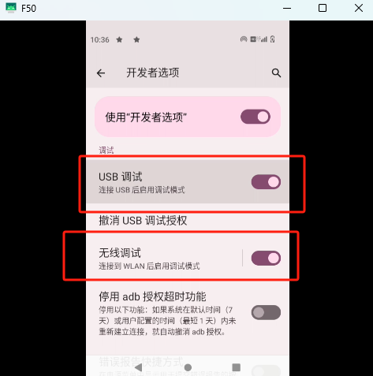

error：试了试无线投屏，结果失败了。（继续usb线连吧，懒得折腾...）

## 4、安装SmsForwarder-短信转发器

官网地址：https://github.com/pppscn/SmsForwarder

下载地址：[SmsForwarder 发行版 - Gitee.com](https://gitee.com/pp/SmsForwarder/releases)

> 推荐配置免费邮件转发通道，转发规则匹配短信内容，关键字“验证码”。
>
> 邮箱需要开启POP3/SMTP/IMAP服务

效果如图：


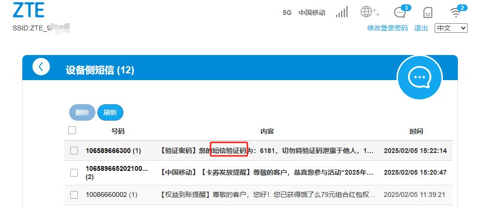

中兴F50 web页面收到短信2条。但只转发其中包含验证码的短信。

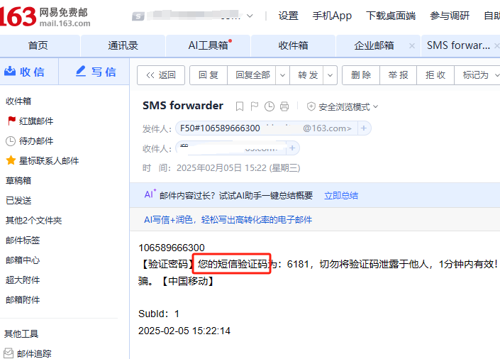

测试结果：成功收到验证码。

## 5、安装任意Android软件&Root刷机

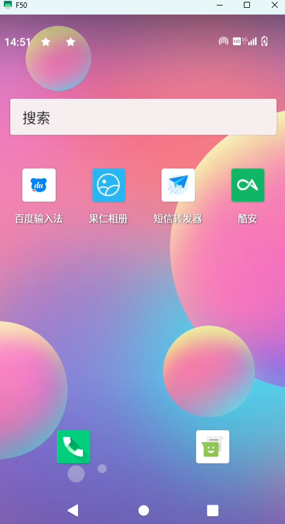

# 进阶玩法

## 1、提取并备份F50固件和中兴apk

```
MU300:/ $ pm list packages|grep zte
pm list packages|grep zte
package:com.android.networkstack.inprocess_zte.overlay
package:com.zte.zdm
package:com.zte.analytics
package:com.android.networkstack.tethering_zte.overlay
package:com.zte.thermalbridge
package:com.zte.web
package:com.zte.zdmdaemon
package:cn.zte.aftersale
package:com.zte.neopush
package:com.google.android.connectivity.resources_zte.overlay
package:com.android.wifi.resources_zte.overlay
package:com.zte.zdmdaemon.install
package:com.zte.flagreset
package:com.android.networkstack.tethering.inprocess_zte.overlay
package:com.zte.telephony.api
MU300:/ $
```


## 2、捡漏二手5G手机改散热和wifi天线

## 3、刷机


