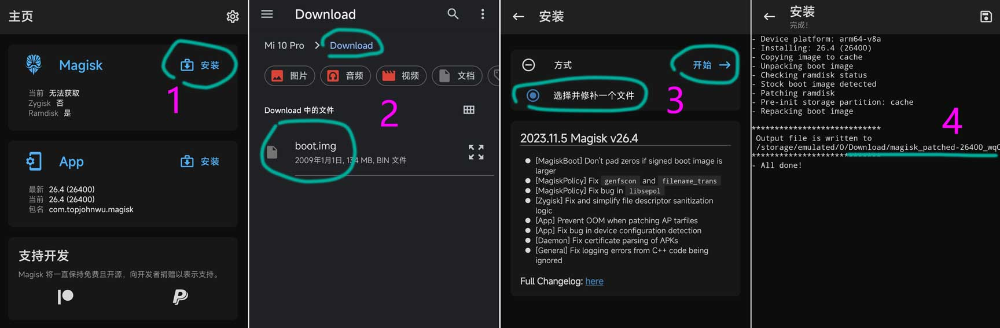

# ADB刷机入门

## 引言

刷机是安卓手机用户中常见的一项操作，它可以帮助用户升级系统、恢复出厂设置或安装第三方系统。而ADB（Android Debug Bridge）刷机则是其中一种方法，它允许用户通过命令行工具与手机进行交互。本文将详细解析ADB刷机的整个过程，帮助用户解决安卓手机刷机难题。

## ADB简介

ADB（Android Debug Bridge）是一个强大的命令行工具，它允许用户与Android设备进行通信。通过ADB，用户可以安装或卸载应用程序、管理设备文件系统、传输文件、查看设备状态等。

## ADB刷机准备工作

### 1. 下载ADB工具包

首先，您需要下载ADB工具包。您可以从以下链接下载最新版本的ADB与Fastboot工具：

- [ADB与Fastboot for Windows](https://dl.google.com/android/repository/platform-tools-latest-windows.zip)
- [ADB与Fastboot for Mac](https://dl.google.com/android/repository/platform-tools-latest-darwin.zip)

### 2. 解压工具包

下载完成后，解压ADB工具包到合适的位置。如下：

```shell
    目录: F:\Android刷机\platform-tools


Mode                 LastWriteTime         Length Name
----                 -------------         ------ ----
-a----        2024/12/27     10:23        5969000 adb.exe
-a----        2024/12/27     10:23         108136 AdbWinApi.dll
-a----        2024/12/27     10:23          73320 AdbWinUsbApi.dll
-a----        2024/12/27     10:23         451688 etc1tool.exe
-a----        2024/12/27     10:23        1874536 fastboot.exe
-a----        2024/12/27     10:23          54376 hprof-conv.exe
-a----        2024/12/27     10:23         242968 libwinpthread-1.dll
-a----        2024/12/27     10:23         479848 make_f2fs.exe
-a----        2024/12/27     10:23         479848 make_f2fs_casefold.exe
-a----        2024/12/27     10:23           1157 mke2fs.conf
-a----        2024/12/27     10:23         756840 mke2fs.exe
-a----        2024/12/27     10:23        1089833 NOTICE.txt
-a----        2024/12/27     10:23             38 source.properties
-a----        2024/12/27     10:23        2912360 sqlite3.exe
```


### 3. 允许USB调试

在您的安卓手机上，进入“设置” > “开发者选项” > “USB调试”，确保USB调试已开启。

### 4. 连接手机和电脑

使用USB数据线将手机连接到电脑。

## ADB刷机步骤

### 1. 打开命令提示符窗口

在解压后的ADB工具包目录中，右键点击空白处，选择“在此处打开命令窗口”。

### 2. 检查ADB版本

在命令窗口中，输入以下命令检查ADB版本：

```bash
adb version
```

如果命令执行成功，将会显示ADB的版本信息。

### 3. 检查设备连接

输入以下命令检查设备是否已连接：

```bash
adb devices
```

如果设备已连接，将会显示设备的序列号。

### 4. 刷机操作

- **刷入刷机包**：

输入以下命令，将刷机包传输到设备：

```bash
  adb sideload <rom-file-path>
```

其中`<rom-file-path>`是刷机包的路径。

如果路径较长，您可以利用鼠标将刷机包拖拽到命令窗口。

- **重启设备**：

刷机完成后，输入以下命令重启设备：

```bash
  adb reboot
```

## 注意事项

- 在刷机前，请确保备份手机中的重要数据，以防数据丢失。
- 如果您使用的是第三方刷机包，请确保其来源可靠，以避免潜在的安全风险。
- 如果在刷机过程中遇到问题，请尝试重新连接设备或重新下载刷机包。

## 总结

ADB刷机是一种强大的安卓手机刷机方法，它可以帮助用户轻松完成刷机操作。通过本文的教程，用户应该能够掌握ADB刷机的全过程。在刷机过程中，请务必小心谨慎，确保操作正确无误。

```
lrwxrwxrwx 1 root root 21 1970-01-01 08:00 boot_a -> /dev/block/mmcblk0p37
lrwxrwxrwx 1 root root 21 1970-01-01 08:00 boot_b -> /dev/block/mmcblk0p38

dd if=/dev/block/by-name/boot_a of=/sdcard/boot_a.img
```


# Fastboot快速启动模式入门

在安卓手机中Fastboot是一种比Recovery恢复模式更底层的刷机模式（俗称引导模式）。就是使用USB数据线连接手机的一种刷机模式。

## 启用 USB 连接

在设备上运行 Android 之前，必须先启用 USB 连接：

1. 在开发者选项中启用“OEM 解锁”和“USB 调试”：

   1. 在“设置”应用中，点按**关于手机**。
   2. 连续点按**版本号**七次。
   3. 当您看到**“您现在处于开发者模式！”**消息后，点按 **<-**。
   4. 依次点按**系统**和**开发者选项**。
   5. 启用 **OEM 解锁**和 **USB 调试**。如果“OEM 解锁”不可用，请连接到互联网，以便设备可以签入。如果上述方法不起作用，您可以强制签入：在拨号器应用中，输入 ***#\*#CHECKIN#\*#\*** (*#*#2432546#*#*)（无需 SIM 卡）。输入此号码（不需要按“通话”）后，相应文字即会消失，并且系统会显示成功通知。

   如果“OEM 解锁”仍然不可用，说明您的设备可能已被运营商锁定 SIM 卡，系统无法解锁引导加载程序。

2. 将您的设备连接到工作站上的 USB 端口。

## 启动进入 Fastboot 模式

设备必须处于 Fastboot 模式，系统才能将 Android 刷写到设备上。您可以通过以下两种方式启动设备进入 Fastboot 模式：

- 使用 `adb` 命令：在命令行中，输入 `adb reboot bootloader`。
- 使用组合键（一般为`音量+ `与 `开机键` 组合）：
  1. 确定适用于您的设备的组合键。如需查看 fastboot 组合键表格，请参阅 [fastboot 组合键](https://source.android.google.cn/docs/setup/reference/fastboot-keys?hl=zh-cn)。
  2. 关闭设备。
  3. 打开设备，然后立即按住适用于您设备的组合键（已在第 1 步中确定）。

## 解锁引导加载程序

启动进入 Fastboot 模式后，您必须解锁引导加载程序。

如需解锁引导加载程序，请执行以下操作：

1. （可选）备份设备上的所有重要文件。

2. 运行适用于您设备的解锁命令：

   - 如果您要更新的是 2015 年或之后制造的 Nexus 或 Pixel 设备，请运行 `fastboot flashing unlock`。
   - 如果您要解锁 2015 年之前的设备，请运行 `fastboot oem unlock`。

   目标设备将显示确认屏幕。

3. 确认您要清除所有用户数据并解锁设备。

## 刷写设备

您可以使用单个命令刷写整个 Android 系统。使用单个命令刷写整个系统可验证要刷写的系统是否与已安装的引导加载程序和无线装置兼容，将启动分区、恢复分区和系统分区一起写入，并重新启动系统。

如需刷写设备，请执行以下操作：

1. 在启动时按住相应的组合键或使用以下命令使设备进入 Fastboot 模式：

   ```
   adb reboot bootloader
   ```

2. 在设备处于 Fastboot 模式后，运行以下命令：

   ```
   fastboot flashall -w
   ```

使用 `-w` 选项会擦除设备上的 `/data` 分区，这在您首次刷写特定设备时非常有用。

**注意：**使用 `fastboot` 创建的文件系统在 Motorola Xoom 上无法发挥最佳作用。Google 建议您使用 `adb reboot recovery` 通过恢复模式重新创建文件系统。在恢复模式下，打开菜单（同时按**电源键和音量调高键**），擦除缓存分区，然后擦除数据。

### 重新锁定引导加载程序

如需重新锁定引导加载程序，请执行以下命令：

- 对于 2015 或更高版本的设备，请运行命令 `fastboot flashing lock`
- 对于 2014 或更低版本的设备，请运行命令 `fastboot oem lock`

# [Magisk](https://topjohnwu.github.io/Magisk/)入门

## 准备工作

- 本教程假定您了解如何使用 `adb`和`fastboot`
- 您设备的引导加载程序必须解锁
- 如果您的设备有 boot ramdisk，请获取 的副本（如果存在）。如果您的设备没有boot ramdisk，您应该能够从官方固件包或自定义 ROM zip 中提取所需的文件。`boot.img`、`init_boot.img`、`recovery.img`

## 下载

1. 下载系统包：[rom](https://magiskcn.com/rom)（一定要下载和手机系统版本一致的系统包）

2. 手机下载 [Magisk app](https://github.com/topjohnwu/Magisk/releases/latest)并安装。

3. [payload-dumper-go-boot](https://magiskcn.com/payload-dumper-go-boot)（如果系统包有 **boot.img**，可以跳过此步骤）

4. 提取 **boot.img** 

   1. ①：安装Magisk
   2. ②：选择 boot.img。提取 **boot.img** ：[payload-dumper-go-boot](https://magiskcn.com/payload-dumper-go-boot)（如果系统包有 **boot.img**，可以跳过此步骤）
   3. ③：开始修补文件 
   4. ④：修补完成 （修补生成 magisk_patched-xxx.img 文件在 Download 目录）

   

   后续步骤参考：[Magisk 安装教程 - Magisk 中文网](https://magiskcn.com/)

# TWRP

TWRP是国外安卓爱好者开发的一款工具，全名为Team Win Recovery Project，主要作用包括刷机、备份 ，救砖。

